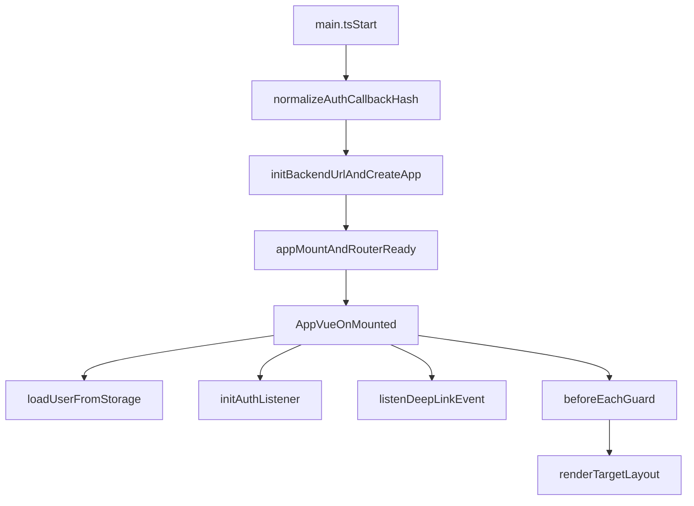
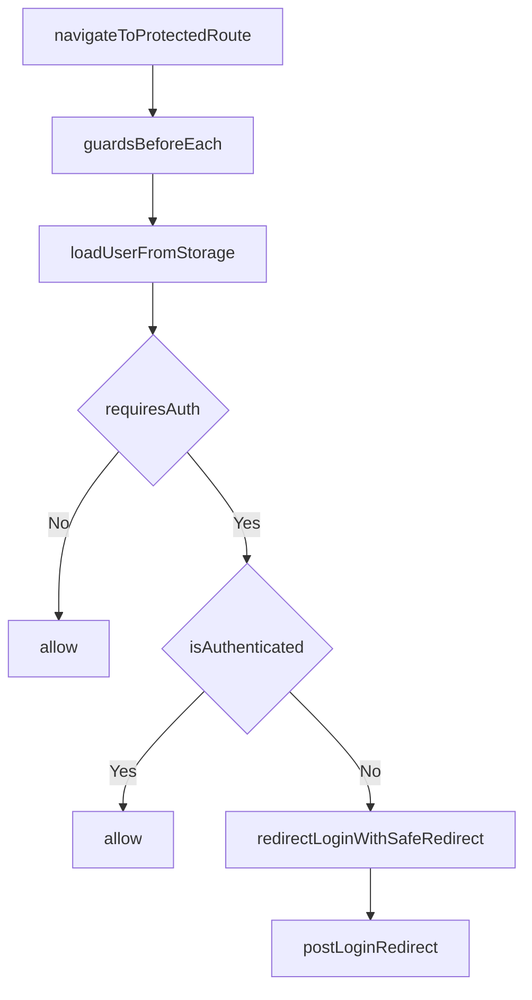
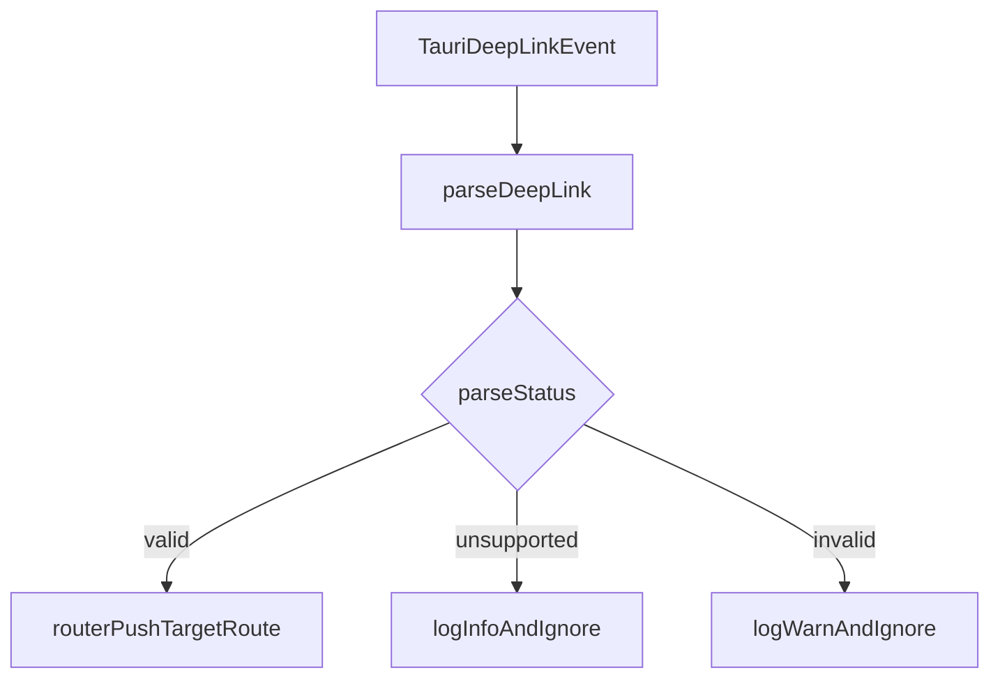

# DawnChat Frontend Router Guide

本文件面向需要快速理解项目路由系统的开发者/LLM Agent，聚焦架构与核心流程，不展开实现细节。

## 1. 路由系统目标

- 以 `vue-router` 作为导航单一真相源（Single Source of Truth）。
- 将主壳路由（`/app/*`）与全屏路由（`/fullscreen/*`）分层，避免页面语义混杂。
- 对登录拦截、Deep Link、全屏回退提供统一策略，提升稳定性与可扩展性。
- 在路由层统一产出结构化导航日志，降低埋点散落。

## 2. 路由分层概览

- `public layer`: `login`、`auth-callback`
- `app shell layer`: `AppShellLayout` + `space/section` 业务路由（`/app/*`）
- `fullscreen layer`: `FullscreenLayout`（当前主要承载插件全屏）

```mermaid
flowchart TD
  externalInput[UserActionOrDeepLink] --> routerCore[vueRouterHashHistory]
  routerCore --> guards[guards.ts]
  guards --> appRoutes[/app/*]
  guards --> publicRoutes[/loginAndAuthCallback]
  guards --> fullscreenRoutes[/fullscreen/*]
  appRoutes --> appShell[AppShellLayout]
  fullscreenRoutes --> fullscreenLayout[FullscreenLayout]
  routerCore --> analytics[analytics.ts]
```

## 3. 关键文件与职责

- `index.ts`
  - 创建 router（hash history）。
  - 统一注册守卫与路由分析日志。

- `routes.ts`
  - 路由总表与路由元信息中心。
  - 定义 `AppRouteMeta`（鉴权、布局、空间、埋点结构字段）。
  - 定义主壳路由、全屏子路由、404 回退。

- `guards.ts`
  - 全局前置守卫。
  - 登录拦截与安全 redirect 归一化（防止不安全回跳）。

- `deepLink.ts`
  - Deep Link 协议解析（`valid/invalid/unsupported` 分级）。
  - 全屏页面 `from` 回退目标的安全解析。
  - Auth callback hash 规范化（冷启动前处理）。

- `manifest.ts`
  - `space` 级别的 UI 配置中心（默认 section、navigator、view、标题 key）。
  - 支撑 `AppShellLayout` 由配置驱动，减少硬编码 switch。

- `navigation.ts`
  - 统一路由跳转 helper（`goToSpace/goToSection/openPluginFullscreen/openPipelineTask`）。
  - 约束业务侧避免直接拼接 path/query。

- `analytics.ts`
  - 在 `afterEach` 中输出结构化路由日志（feature/pageType/entityType/entityId 等）。

- `types.ts`
  - 路由域的轻量类型定义（路由名、回退来源类型、Deep Link 结果类型别名）。

- `__tests__/*`
  - 路由核心策略回归测试：守卫、Deep Link、导航 helper、全屏回退。

## 4. 关键运行流程

## 4.1 冷启动流程（App 启动到首屏）



高层说明：
- 冷启动先做 auth callback URL 规范化，再挂载 router。
- App 初始化阶段完成主题、i18n、认证状态与 Deep Link 监听。
- 首次路由进入统一经过守卫，再渲染 `public/app/fullscreen` 对应布局。

## 4.2 登录拦截流程（受保护路由）



高层说明：
- 守卫不直接在多个来源做鉴权判断，而是统一走 `useAuth`。
- 未登录访问受保护路由时，附带安全 `redirect` 参数跳转登录页。
- 已登录访问登录页时，会按安全规则回跳目标路由。

## 4.3 Deep Link 跳转流程



高层说明：
- Deep Link 解析采用分级结果，避免“失败即异常”导致路由不稳定。
- 仅 `valid` 结果进入路由跳转；其余结果记录日志并安全忽略。

## 4.4 全屏插件页退出回退流程

- 全屏页关闭与异常回退统一调用 `resolveFullscreenBackTarget()`。
- `from` 参数只有在“应用内安全路径”时才被信任。
- 无效来源统一降级到 `/app/apps/installed`，保证可恢复。

## 5. 对 LLM Agent 的快速操作建议

- 需要新增一个 space：
  - 先改 `routes.ts`（路由定义与 meta），再改 `manifest.ts`（默认 section、navigator、view）。
  - 业务跳转优先通过 `navigation.ts`。

- 需要新增 Deep Link 协议：
  - 只改 `deepLink.ts` 的解析分支与结果分级。
  - 保持 `valid/invalid/unsupported` 语义一致。

- 需要调整登录与回跳：
  - 优先修改 `guards.ts` 的安全 redirect 规则。
  - 避免在业务组件中分散实现登录拦截。

- 需要增强观测：
  - 在 `routes.ts` 的 meta 增补结构字段。
  - 由 `analytics.ts` 自动输出，不要在页面中重复路由埋点。

## 6. 当前架构边界

- 路由系统已实现“稳态优先”的务实加固：中心化、可回退、可测试。
- 路由协议统一为当前模型：`/app/*`、`/fullscreen/*`、`dawnchat://...`。
- 不再接受 legacy URL 自动迁移；新增路由或跳转能力应通过 `routes.ts + manifest.ts + navigation.ts` 维护。
- 后续演进方向仍是“减少业务层直连 router 实例，进一步收敛到 navigation helper”。
