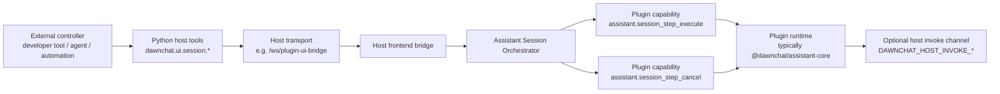

# DawnChat Host–Plugin Session Protocol

## 1. Purpose

This document describes the host-managed session protocol used between DawnChat and frontend plugins.

It is written for plugin developers who want to understand:

- what the host is responsible for,
- what a plugin is responsible for,
- how ordered session steps are started, observed, and stopped,
- where plugin-defined runtime semantics begin.

This document does not define any plugin-internal agent protocol.
It does not require a specific action vocabulary, UI model, narration model, or tool strategy inside a plugin.

---

## 2. Design Position

The protocol is intentionally narrow.

The host owns:

- session lifecycle,
- admission control,
- async execution scheduling,
- status reporting,
- cancellation propagation,
- **transport between the backend, host frontend, and the plugin UI** (see §2.1 for deployment shapes).

The plugin owns:

- step semantics,
- action namespaces,
- view behavior,
- guide behavior,
- optional host service usage,
- the decision of how a step is actually fulfilled.

In other words:

> The host manages the session. The plugin owns the meaning of the work.

### 2.1 Deployment surfaces (current DawnChat)

The **same session contract** (opaque steps, `assistant.session_step_execute` / `assistant.session_step_cancel`) applies whenever a DawnChat-class host orchestrates a plugin. **Transport** depends on how the plugin UI is hosted:

| Surface | Typical packaging | Transport notes |
|---------|-------------------|-----------------|
| **Desktop plugin preview / dev workbench** | Plugin UI in an **iframe** inside the DawnChat Electron/web host | Host frontend uses the plugin UI bridge (e.g. WebSocket path such as `/ws/plugin-ui-bridge`) to post messages to the iframe; optional `DAWNCHAT_HOST_INVOKE_*` for host services (TTS, etc.). This is the **reference** stack illustrated in §3. |
| **Official Web / Mobile assistant** | Standalone SPA (Vite) or Ionic + Capacitor | Runtime logic lives in **`@dawnchat/assistant-core`** (same step executor semantics as desktop). When that UI is **not** embedded in the DawnChat iframe host, there is **no** iframe bridge—session orchestration may be local to the app or wired through a different host adapter. The protocol in this document still describes the **shape** of host tools and step execution when a full DawnChat host is in the loop. |

Plugins should not assume an iframe exists; they should assume the host will invoke the registered `assistant.session_step_execute` / `assistant.session_step_cancel` capabilities when integrated with DawnChat tooling.

---

## 3. Architecture Overview



The important point is that the host-facing API and the plugin-facing API are different:

- external callers talk to `dawnchat.ui.session.*`,
- the host internally dispatches to plugin capabilities such as `assistant.session_step_execute`,
- the host does not interpret plugin business payloads.

---

## 4. Core Contracts

### 4.1 Host-facing session tools

The public host-managed tools are:

- `dawnchat.ui.session.start`
- `dawnchat.ui.session.status`
- `dawnchat.ui.session.stop`
- `dawnchat.ui.event.wait`
- `dawnchat.ui.session.wait_for_end`

These tools are defined in `packages/backend-kernel/app/plugin_ui_bridge/ui_tool_service.py` (search for `dawnchat.ui.session` / `dawnchat.ui.event.wait`).

Their role is to provide a stable control-plane contract for any external caller.

### 4.2 Plugin-facing execution capabilities

The host executes plugin work through:

- `assistant.session_step_execute`
- `assistant.session_step_cancel`

These capabilities are implemented by the **plugin runtime**. In official assistants, step dispatch is centralized in **`@dawnchat/assistant-core`**:

- `dawnchat-plugins/assistant-sdk/assistant-core/src/runtime/session/stepExecutor.ts`

The desktop AI assistant IR frontend re-exports this module for bundle convenience (`desktop-ai-assistant/.../src/runtime/session/stepExecutor.ts` → `@dawnchat/assistant-core/session`); treat **assistant-core** as the canonical source.

### 4.3 Optional host invoke channel

When the plugin runs inside the **DawnChat host iframe**, it may call host-owned functions through the iframe message bridge:

- `DAWNCHAT_HOST_INVOKE_REQUEST`
- `DAWNCHAT_HOST_INVOKE_RESULT`

This channel is generic. It is not limited to voice, TTS, or any single service. See `apps/frontend/src/services/plugin-ui-bridge/constants.ts` and `apps/frontend/src/composables/usePluginUiBridge.ts` (host invoke handling).

Any specific host service exposed over this channel should be treated as an extension, not as part of the core session protocol.

**Narration / TTS:** `guide.narrate` inside assistant-core may call `AssistantHostAdapter.voice` (`speak` / `stop` / `status`). Desktop plugins often bridge that to the host via `__DAWNCHAT_HOST_VOICE__` or host invoke; mobile official assistant may use Capacitor TTS; a standalone web bundle may omit `voice` until a host adapter is provided. None of that changes the session envelope contract in §6.

---

## 5. Session Model

Each session is host-managed and plugin-scoped.

The current host session state includes:

- `session_id`
- `status`
- `current_step_index`
- `current_step_id`
- `completed_steps`
- `total_steps`
- `progress_percent`
- `started_at_ms`
- `updated_at_ms`
- `ended_at_ms`
- `elapsed_ms`
- `last_error`
- `last_error_code`

The current status values are:

- `running`
- `completed`
- `failed`
- `cancelled`

See `dawnchat-plugins/assistant-sdk/host-orchestration-sdk/src/session-core/useAssistantSessionOrchestrator.ts` (session shape, status builder, and `assistant.session_step_execute` payload). The frontend workbench composes this SDK from `usePluginDevWorkbenchOrchestration.ts`.

The host currently enforces a single active session per plugin. A new `session.start` request is rejected while another session is still running for the same plugin (see active-session admission logic in the same orchestrator composable).

---

## 6. Step Envelope

`dawnchat.ui.session.start` accepts an ordered `steps[]` array.

Each step uses a minimal envelope:

- `id` optional
- `action.type` required
- `action.payload` optional object
- `timeout_ms` optional

Example:

```json
{
  "plugin_id": "com.example.plugin",
  "steps": [
    {
      "id": "step-open",
      "action": {
        "type": "view.open",
        "payload": {
          "view_id": "tictactoe.main"
        }
      },
      "timeout_ms": 30000
    }
  ]
}
```

The host treats `action.payload` as opaque data.
It validates the outer envelope, but it does not interpret plugin business meaning. See `ui_tool_service.py` (session start schema) and `useAssistantSessionOrchestrator.ts` (step normalization).

### 6.1 `assistant.session_step_execute` and `step_index` / `total_steps`

When the host dispatches an ordered step to the plugin, the **reference** DawnChat host includes:

- `session_id`, `step_id`, `action`, optional `timeout_ms`
- **`step_index`**: zero-based index of the current step in the batch
- **`total_steps`**: `steps.length` for that session start batch

Canonical implementation: `dawnchat-plugins/assistant-sdk/host-orchestration-sdk/src/session-core/useAssistantSessionOrchestrator.ts` (`executeSessionStep`). The workbench wires this package via `usePluginDevWorkbenchOrchestration.ts` (see `apps/frontend`).

**Workspace snapshot note (`@dawnchat/assistant-core`):** If the plugin runtime enables `workspaceSnapshotOnSessionEnd` in `composeAssistantCoreRuntime`, the workspace layer appends a `session_completed` snapshot only after the **last** step succeeds, and only when **`step_index` and `total_steps` are both present** on the `onStepApplied` path. Custom hosts that omit these fields will not trigger that snapshot (no error; feature is skipped).

---

## 7. Execution Semantics

### 7.1 Fast acceptance, async execution

`dawnchat.ui.session.start` returns quickly with an accepted session record.
The host then executes steps asynchronously in order. See `useAssistantSessionOrchestrator.ts` (session start and ordered execution).

### 7.2 Plugin-owned step completion

The plugin decides when a step is finished.
If `assistant.session_step_execute` returns `ok: true`, the host advances to the next step.
If it returns `ok: false` or throws, the host marks the session as failed.

### 7.3 Host-propagated cancellation

`dawnchat.ui.session.stop` marks the host session as cancelled and attempts to propagate the stop request into the plugin through `assistant.session_step_cancel`. See stop handling in `useAssistantSessionOrchestrator.ts`.

### 7.4 Pull-based observation

The current public observation path is `dawnchat.ui.session.status`.
Callers poll for state snapshots instead of receiving a plugin-defined push stream from the core protocol.

### 7.5 Decoupled wait surfaces

The wait semantics are intentionally split into two separate tools:

- `dawnchat.ui.event.wait` waits for runtime events only.
- `dawnchat.ui.session.wait_for_end` waits for session terminal state only.

`dawnchat.ui.event.wait` accepts:

- `event_types`
- optional `match`
- optional `timeout_ms`

It is a pure realtime wait:

- it does not require `session_id`,
- it may match events emitted while some session is still running,
- it only waits for events emitted after the wait is established,
- refresh, **iframe reload (desktop)**, or WebView reload may drop an in-flight wait, and callers should simply start a new wait if still needed.

`dawnchat.ui.session.wait_for_end` accepts:

- `session_id`
- optional `timeout_ms`

It only observes host session lifecycle:

- if the session is already terminal, it returns immediately,
- if the session is still running, it resolves when the session becomes `completed`, `failed`, or `cancelled`,
- it does not interpret runtime events.

The host still does not interpret plugin business payloads:

- the host owns session lifecycle and wait timeout management,
- the plugin owns runtime event meaning and runtime snapshot updates,
- durable truth still belongs to plugin-defined view-owned state or other plugin storage rather than to the event stream itself.

### 7.6 Recommended caller pattern

For interactive or recoverable flows, the recommended external calling pattern is:

1. start or continue a session with `dawnchat.ui.session.start`
2. if the task needs a runtime signal, call `dawnchat.ui.event.wait`
3. if the task needs session completion, call `dawnchat.ui.session.wait_for_end`
4. use `dawnchat.ui.session.status` for explicit snapshot reads, not as the only waiting mechanism
5. if the runtime was interrupted, treat the next step as a fresh control-plane decision rather than assuming a public plugin-side restore entrypoint
6. when the runtime still exposes `continuation`-style hints through snapshot surfaces, use them only as planning hints rather than as a public wait API contract

If the caller cares about both a user/runtime event and session completion, the observation windows should overlap instead of serializing `session.wait_for_end` before `event.wait`.

Important clarification:

- callers should not invent their own event cursor or stream identity model
- product page restore should not assume a public plugin-side restore entry path; stateful views should own their real restore behavior separately
- if a wait was interrupted by refresh or reload, treat the next step as a fresh control-plane decision and start a new wait if still needed

Example runtime-event wait:

```json
{
  "tool": "dawnchat.ui.event.wait",
  "arguments": {
    "event_types": ["assistant.guide.confirm.responded"],
    "match": {
      "confirm_id": "confirm-delete"
    },
    "timeout_ms": 30000
  }
}
```

This keeps the contract narrow:

- `status` remains the snapshot tool,
- `wait` becomes the passive waiting tool,
- any recovery hint remains plugin-defined runtime metadata rather than a guaranteed public restore API,
- `continuation_hint` helps the caller decide the next session or wait boundary when available.

---

## 8. What the Protocol Does Not Care About

This protocol does not prescribe:

- whether the caller is an agent, script, developer tool, or another runtime,
- how a plugin interprets `guide.*`, `view.*`, `session.*`, or `flow.*`,
- how a plugin structures its internal view state or runtime observation state,
- whether a plugin uses narration, TTS, overlays, cards, or any other UI idiom,
- which optional host services a plugin invokes,
- whether the plugin UI is iframe-hosted or a standalone SPA, as long as the host can invoke the same capabilities.

For example, the official AI Assistant uses namespaced actions such as `guide.*` and `view.*`; dispatch is implemented in **`@dawnchat/assistant-core`** (`dawnchat-plugins/assistant-sdk/assistant-core/src/runtime/session/stepExecutor.ts` and related runtimes). Those are plugin runtime conventions rather than host protocol requirements.

---

## 9. Extensibility Model

The protocol is designed to stay stable at the envelope layer while allowing plugins to evolve freely inside it.

That means:

- the host keeps a narrow lifecycle contract,
- plugins evolve action namespaces independently,
- optional host services stay out of the core session contract,
- new plugin runtimes can be introduced without redesigning session lifecycle semantics,
- shared runtime logic can live in **`@dawnchat/assistant-core`** and be reused across desktop, web, and mobile assistant bundles.

This is the main reason the protocol remains useful even as plugin behavior becomes more sophisticated.

---

## 10. Reference Implementation

**Host (DawnChat app + workbench)**

- Host tool definitions: `packages/backend-kernel/app/plugin_ui_bridge/ui_tool_service.py`
- Host bridge and iframe dispatch: `apps/frontend/src/composables/usePluginUiBridge.ts`
- Host session orchestration: `apps/frontend/src/features/plugin-dev-workbench/composables/useAssistantSessionOrchestrator.ts`

**Plugin runtime (canonical)**

- Step execution and cancellation: `dawnchat-plugins/assistant-sdk/assistant-core/src/runtime/session/stepExecutor.ts`
- Runtime event bus: `dawnchat-plugins/assistant-sdk/assistant-core/src/runtime/events/createAssistantEventBus.ts`
- `flow.wait` execution: `dawnchat-plugins/assistant-sdk/assistant-core/src/runtime/flowRuntime.ts`
- Core runtime assembly: `dawnchat-plugins/assistant-sdk/assistant-core/src/runtime/bootstrap/composeRuntime.ts`

**Official assistant shells** (thin compose + host adapter; import assistant-core):

- Desktop IR: `dawnchat-plugins/official-plugins/desktop-ai-assistant/_ir/frontend/web-src/src/runtime/bootstrap/composeRuntime.ts`
- Web: `dawnchat-plugins/official-plugins/web-ai-assistant/web-src/src/runtime/bootstrap/composeWebAssistantRuntime.ts`
- Mobile: `dawnchat-plugins/official-plugins/mobile-ai-assistant/web-src/src/runtime/bootstrap/composeMobileAssistantRuntime.ts`

The official AI Assistant uses this protocol as a reference app when driven by the DawnChat host; the protocol itself is host–plugin infrastructure and should be understood independently from any one assistant behavior model.
