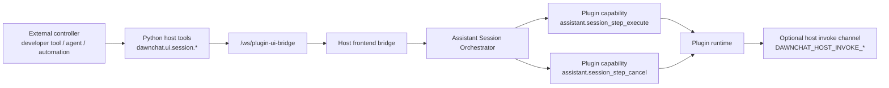

# DawnChat Host–Plugin Session Protocol

## 1. Purpose

This document describes the host-managed session protocol used between DawnChat and frontend plugins.

It is written for plugin developers who want to understand:

- what the host is responsible for,
- what a plugin is responsible for,
- how ordered session steps are started, observed, and stopped,
- where plugin-defined runtime semantics begin.

This document does not define any plugin-internal agent protocol.
It does not require a specific action vocabulary, UI model, narration model, or tool strategy inside a plugin.

---

## 2. Design Position

The protocol is intentionally narrow.

The host owns:

- session lifecycle,
- admission control,
- async execution scheduling,
- status reporting,
- cancellation propagation,
- bridge transport between the backend, host frontend, and plugin iframe.

The plugin owns:

- step semantics,
- action namespaces,
- view behavior,
- guide behavior,
- optional host service usage,
- the decision of how a step is actually fulfilled.

In other words:

> The host manages the session. The plugin owns the meaning of the work.

---

## 3. Architecture Overview



The important point is that the host-facing API and the plugin-facing API are different:

- external callers talk to `dawnchat.ui.session.*`,
- the host internally dispatches to plugin capabilities such as `assistant.session_step_execute`,
- the host does not interpret plugin business payloads.

---

## 4. Core Contracts

### 4.1 Host-facing session tools

The public host-managed tools are:

- `dawnchat.ui.session.start`
- `dawnchat.ui.session.status`
- `dawnchat.ui.session.stop`
- `dawnchat.ui.event.wait`
- `dawnchat.ui.session.wait_for_end`

These tools are defined in [ui_tool_service.py](file:///Users/zhutao/Cursor/DawnChat/packages/backend-kernel/app/plugin_ui_bridge/ui_tool_service.py#L402-L466).

Their role is to provide a stable control-plane contract for any external caller.

### 4.2 Plugin-facing execution capabilities

The host executes plugin work through:

- `assistant.session_step_execute`
- `assistant.session_step_cancel`

These capabilities are implemented by the plugin runtime, not by the host. See [sessionStepExecutor.ts](file:///Users/zhutao/Cursor/DawnChat/dawnchat-plugins/official-plugins/desktop-ai-assistant/_ir/frontend/web-src/src/runtime/sessionStepExecutor.ts#L151-L344).

### 4.3 Optional host invoke channel

Plugins may also call host-owned functions through the iframe message bridge:

- `DAWNCHAT_HOST_INVOKE_REQUEST`
- `DAWNCHAT_HOST_INVOKE_RESULT`

This channel is generic. It is not limited to voice, TTS, or any single service. See [constants.ts](file:///Users/zhutao/Cursor/DawnChat/apps/frontend/src/services/plugin-ui-bridge/constants.ts#L9-L28) and [usePluginUiBridge.ts](file:///Users/zhutao/Cursor/DawnChat/apps/frontend/src/composables/usePluginUiBridge.ts#L291-L357).

Any specific host service exposed over this channel should be treated as an extension, not as part of the core session protocol.

---

## 5. Session Model

Each session is host-managed and plugin-scoped.

The current host session state includes:

- `session_id`
- `status`
- `current_step_index`
- `current_step_id`
- `completed_steps`
- `total_steps`
- `progress_percent`
- `started_at_ms`
- `updated_at_ms`
- `ended_at_ms`
- `elapsed_ms`
- `last_error`
- `last_error_code`

The current status values are:

- `running`
- `completed`
- `failed`
- `cancelled`

See [useAssistantSessionOrchestrator.ts](file:///Users/zhutao/Cursor/DawnChat/apps/frontend/src/features/plugin-dev-workbench/composables/useAssistantSessionOrchestrator.ts#L18-L32) and [the session status builder](file:///Users/zhutao/Cursor/DawnChat/apps/frontend/src/features/plugin-dev-workbench/composables/useAssistantSessionOrchestrator.ts#L67-L88).

The host currently enforces a single active session per plugin. A new `session.start` request is rejected while another session is still running for the same plugin. See [active session admission](file:///Users/zhutao/Cursor/DawnChat/apps/frontend/src/features/plugin-dev-workbench/composables/useAssistantSessionOrchestrator.ts#L230-L247).

---

## 6. Step Envelope

`dawnchat.ui.session.start` accepts an ordered `steps[]` array.

Each step uses a minimal envelope:

- `id` optional
- `action.type` required
- `action.payload` optional object
- `timeout_ms` optional

Example:

```json
{
  "plugin_id": "com.example.plugin",
  "steps": [
    {
      "id": "step-open",
      "action": {
        "type": "view.open",
        "payload": {
          "view_id": "paper.main"
        }
      },
      "timeout_ms": 30000
    }
  ]
}
```

The host treats `action.payload` as opaque data.
It validates the outer envelope, but it does not interpret plugin business meaning. See [tool schema](file:///Users/zhutao/Cursor/DawnChat/packages/backend-kernel/app/plugin_ui_bridge/ui_tool_service.py#L402-L435) and [step normalization](file:///Users/zhutao/Cursor/DawnChat/apps/frontend/src/features/plugin-dev-workbench/composables/useAssistantSessionOrchestrator.ts#L45-L65).

---

## 7. Execution Semantics

### 7.1 Fast acceptance, async execution

`dawnchat.ui.session.start` returns quickly with an accepted session record.
The host then executes steps asynchronously in order. See [session start](file:///Users/zhutao/Cursor/DawnChat/apps/frontend/src/features/plugin-dev-workbench/composables/useAssistantSessionOrchestrator.ts#L230-L293) and [ordered execution](file:///Users/zhutao/Cursor/DawnChat/apps/frontend/src/features/plugin-dev-workbench/composables/useAssistantSessionOrchestrator.ts#L167-L212).

### 7.2 Plugin-owned step completion

The plugin decides when a step is finished.
If `assistant.session_step_execute` returns `ok: true`, the host advances to the next step.
If it returns `ok: false` or throws, the host marks the session as failed.

### 7.3 Host-propagated cancellation

`dawnchat.ui.session.stop` marks the host session as cancelled and attempts to propagate the stop request into the plugin through `assistant.session_step_cancel`. See [stop handling](file:///Users/zhutao/Cursor/DawnChat/apps/frontend/src/features/plugin-dev-workbench/composables/useAssistantSessionOrchestrator.ts#L319-L377).

### 7.4 Pull-based observation

The current public observation path is `dawnchat.ui.session.status`.
Callers poll for state snapshots instead of receiving a plugin-defined push stream from the core protocol.

### 7.5 Decoupled wait surfaces

The wait semantics are intentionally split into two separate tools:

- `dawnchat.ui.event.wait` waits for runtime events only.
- `dawnchat.ui.session.wait_for_end` waits for session terminal state only.

`dawnchat.ui.event.wait` accepts:

- `event_types`
- optional `match`
- optional `timeout_ms`

It is a pure realtime wait:

- it does not require `session_id`,
- it may match events emitted while some session is still running,
- it only waits for events emitted after the wait is established,
- refresh or iframe reload may drop an in-flight wait, and callers should simply start a new wait if still needed.

`dawnchat.ui.session.wait_for_end` accepts:

- `session_id`
- optional `timeout_ms`

It only observes host session lifecycle:

- if the session is already terminal, it returns immediately,
- if the session is still running, it resolves when the session becomes `completed`, `failed`, or `cancelled`,
- it does not interpret runtime events.

The host still does not interpret plugin business payloads:

- the host owns session lifecycle and wait timeout management,
- the plugin owns runtime event meaning and runtime snapshot updates,
- durable truth still belongs to plugin-defined view-owned state or other plugin storage rather than to the event stream itself.

### 7.6 Recommended caller pattern

For interactive or recoverable flows, the recommended external calling pattern is:

1. start or continue a session with `dawnchat.ui.session.start`
2. if the task needs a runtime signal, call `dawnchat.ui.event.wait`
3. if the task needs session completion, call `dawnchat.ui.session.wait_for_end`
4. use `dawnchat.ui.session.status` for explicit snapshot reads, not as the only waiting mechanism
5. if the runtime was interrupted, treat the next step as a fresh control-plane decision rather than assuming a public plugin-side restore entrypoint
6. when the runtime still exposes `continuation`-style hints through snapshot surfaces, use them only as planning hints rather than as a public wait API contract

Important clarification:

- callers should not invent their own event cursor or stream identity model
- product page restore should not assume a public plugin-side restore entry path; stateful views should own their real restore behavior separately
- if a wait was interrupted by refresh or reload, treat the next step as a fresh control-plane decision and start a new wait if still needed

Example runtime-event wait:

```json
{
  "tool": "dawnchat.ui.event.wait",
  "arguments": {
    "event_types": ["assistant.guide.confirm.responded"],
    "match": {
      "confirm_id": "confirm-delete"
    },
    "timeout_ms": 30000
  }
}
```

This keeps the contract narrow:

- `status` remains the snapshot tool,
- `wait` becomes the passive waiting tool,
- any recovery hint remains plugin-defined runtime metadata rather than a guaranteed public restore API,
- `continuation_hint` helps the caller decide the next session or wait boundary when available.

---

## 8. What the Protocol Does Not Care About

This protocol does not prescribe:

- whether the caller is an agent, script, developer tool, or another runtime,
- how a plugin interprets `guide.*`, `view.*`, `session.*`, or `flow.*`,
- how a plugin structures its internal view state or runtime observation state,
- whether a plugin uses narration, TTS, overlays, cards, or any other UI idiom,
- which optional host services a plugin invokes.

For example, the official AI Assistant currently uses namespaced actions such as `guide.*` and `view.*`, but those are plugin runtime conventions rather than host protocol requirements. See [runtime namespace dispatch](file:///Users/zhutao/Cursor/DawnChat/dawnchat-plugins/official-plugins/desktop-ai-assistant/_ir/frontend/web-src/src/runtime/sessionStepExecutor.ts#L155-L203).

---

## 9. Extensibility Model

The protocol is designed to stay stable at the envelope layer while allowing plugins to evolve freely inside it.

That means:

- the host keeps a narrow lifecycle contract,
- plugins evolve action namespaces independently,
- optional host services stay out of the core session contract,
- new plugin runtimes can be introduced without redesigning session lifecycle semantics.

This is the main reason the protocol remains useful even as plugin behavior becomes more sophisticated.

---

## 10. Reference Implementation

The current reference implementation lives in these files:

- Host tool definitions: [ui_tool_service.py](file:///Users/zhutao/Cursor/DawnChat/packages/backend-kernel/app/plugin_ui_bridge/ui_tool_service.py#L402-L466)
- Host bridge and iframe dispatch: [usePluginUiBridge.ts](file:///Users/zhutao/Cursor/DawnChat/apps/frontend/src/composables/usePluginUiBridge.ts#L117-L357)
- Host session orchestration: [useAssistantSessionOrchestrator.ts](file:///Users/zhutao/Cursor/DawnChat/apps/frontend/src/features/plugin-dev-workbench/composables/useAssistantSessionOrchestrator.ts#L90-L397)
- Plugin step execution and cancellation: [sessionStepExecutor.ts](file:///Users/zhutao/Cursor/DawnChat/dawnchat-plugins/official-plugins/desktop-ai-assistant/_ir/frontend/web-src/src/runtime/sessionStepExecutor.ts#L151-L344)
- Plugin runtime event bus and recent-window persistence: [createAssistantEventBus.ts](file:///Users/zhutao/Cursor/DawnChat/dawnchat-plugins/official-plugins/desktop-ai-assistant/_ir/frontend/web-src/src/runtime/events/createAssistantEventBus.ts)
- Plugin `flow.wait` execution: [flowRuntime.ts](file:///Users/zhutao/Cursor/DawnChat/dawnchat-plugins/official-plugins/desktop-ai-assistant/_ir/frontend/web-src/src/runtime/flowRuntime.ts)

The official AI Assistant uses this protocol as a reference app, but the protocol itself is host–plugin infrastructure and should be understood independently from any one assistant behavior model.
