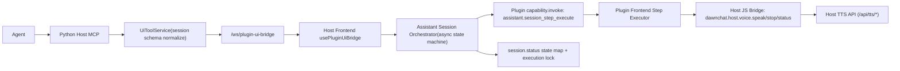
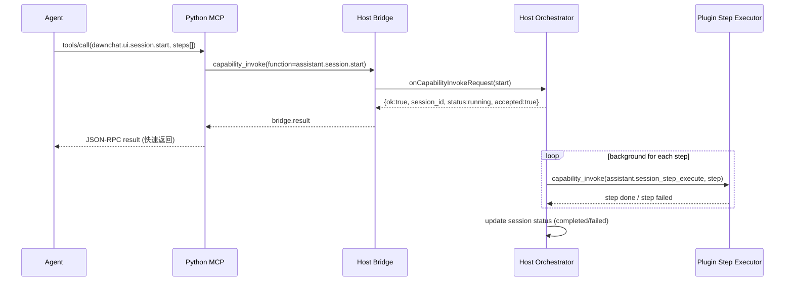
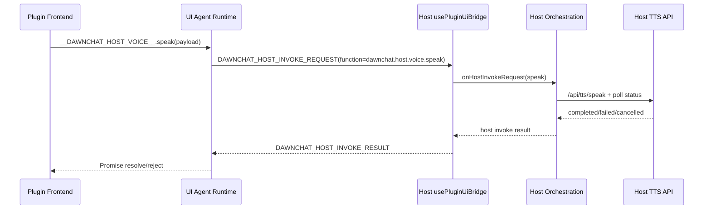
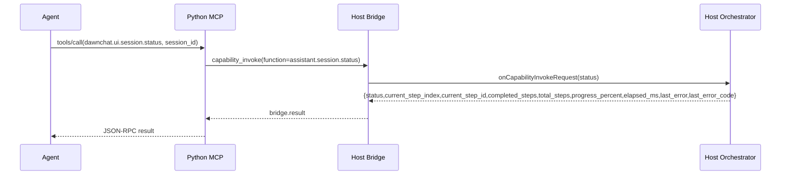
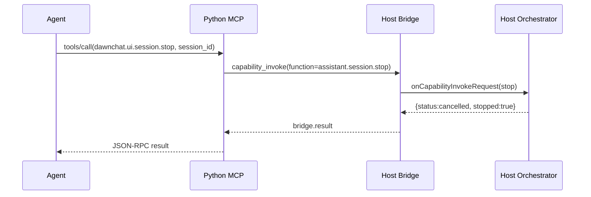

# AI Agent 视觉 + 语音讲解系统架构说明（2026 重构版）

## 1. 文档目标

- 说明 DawnChat 视觉+语音 MCP 的系统定位：为 AI 助理类插件提供“可执行页面 + 语音讲解 + 会话调度”能力。
- 说明 Agent 在开发与交互过程中的使用方式：一边改插件代码，一边调用新页面与用户互动。
- 明确宿主与插件职责边界，保证 step 内部编排由插件自治、宿主管理会话生命周期。
- 给出核心调用链路与状态机，帮助定位“状态不一致”“并发重入”“会话卡住”等问题。
- 提供关键代码索引，便于后续扩展 action 类型与会话能力。

---

## 2. 背景与定位

这套 MCP 面向 `dawnchat-plugins/official-plugins/desktop-ai-assistant` 这类 AI 助理插件，核心目标不是“单次渲染页面”，而是支持 Agent 在真实对话中进行连续的视觉与语音交互：

- Agent 可在开发过程中动态修改插件代码，并立即调用新生成的页面能力与用户互动。
- Agent 可通过语音能力向用户讲解复杂内容，同时驱动页面状态变化（卡片、动画、交互控件等）。
- 宿主负责会话级调度与可观测性，插件负责 step 内部执行细节。

### 2.1 解决的问题

- 把离散的 UI 操作收敛到统一会话模型（`start/status/stop`），避免无序并发调用导致状态混乱。
- 让 Agent 拥有“可观测会话进度”能力，可根据 `status` 决定继续、等待或中断。
- 让插件拥有“执行自治”能力，支持复杂音画同步与交互驱动流程，而不是被宿主固定编排限制。

### 2.2 当前架构目标

- **统一入口**：通过 `dawnchat.ui.session.start/status/stop` 管理视觉+语音交互会话。
- **快速响应**：`session.start` 快速 ACK，后台异步推进 step，降低阻塞与超时风险。
- **插件自治**：step 细节保持在 `action.payload`，宿主不解析业务字段。
- **可观测可控**：`session.status` 返回进度/时长/错误等观测信息，`session.stop` 支持主动终止。

---

## 3. 总体架构（最新）

---

## 4. 角色与职责

### 4.1 Agent（内容规划）

- 负责生成 `steps[]`，以 `action` 为核心。
- 不再要求提供宿主消费的 `narration` 外层字段。

### 4.2 Python Host MCP（协议入口与归一化）

- 对外提供：
  - `dawnchat.ui.session.start`
  - `dawnchat.ui.session.status`
  - `dawnchat.ui.session.stop`
- 归一化规则：
  - `action.type` 必填
  - `action.payload` 缺失归一化为 `{}`
  - `timeout_ms` 可选，存在时要求非负数
- 对内仍通过 `capability_invoke` 透传到前端桥接层。

### 4.3 Host Frontend Orchestrator（会话状态机）

- 拦截 `assistant.session.start/status`。
- `start` 立即 ACK，后台异步顺序执行 step。
- 管理状态：`running/completed/failed/cancelled`，并返回详细观测字段（耗时、进度、当前 step）。
- 管理单活跃会话准入与执行锁，防止并发重复执行。

### 4.4 Plugin Frontend（step 执行器）

- 消费 `assistant.session_step_execute` 输入并执行业务动作。
- 视需要主动调用 `dawnchat.host.voice.speak/stop/status`。
- 插件决定 step 何时完成，完成后返回结果给宿主推进下一步。

---

## 5. 稳定协议边界（最新）

### 5.1 `dawnchat.ui.session.start`（宿主域）

- 输入核心字段：
  - `plugin_id`
  - `steps[].action`
  - `steps[].timeout_ms`（可选）
- 设计原则：
  - 宿主不解析 `action.payload` 业务语义
  - 插件对 payload 拥有自治演进权

### 5.2 `assistant.session_step_execute`（插件域）

- 输入核心字段：
  - `session_id`
  - `step_id`
  - `action`
  - `timeout_ms`（可选）
- 当前 action（MVP）：
  - `card.show`

### 5.3 Host Voice Bridge（插件调用宿主域）

- 插件可调用：
  - `dawnchat.host.voice.speak`
  - `dawnchat.host.voice.stop`
  - `dawnchat.host.voice.status`
- 通道基于 iframe message：
  - `DAWNCHAT_HOST_INVOKE_REQUEST`
  - `DAWNCHAT_HOST_INVOKE_RESULT`

### 5.4 `dawnchat.ui.session.stop`（宿主域）

- 输入核心字段：
  - `plugin_id`
  - `session_id`
  - `reason`（可选）
- 行为：
  - running 会话进入 `cancelled`
  - 会话准入锁释放，允许后续 `session.start`

---

## 6. 核心时序图（最新）

### 6.1 session.start 快速 ACK + 异步推进

### 6.2 插件内部调用宿主语音

### 6.3 session.status 查询

### 6.4 session.stop 主动终止

---

## 7. 关键代码文件索引（最新）

### 7.1 Python Host

- `packages/backend-kernel/app/plugin_ui_bridge/ui_tool_service.py`
  - `session.start/status/stop` 工具定义
  - step 归一化（`action` + `timeout_ms`）
- `packages/backend-kernel/tests/unit/plugin_ui_bridge/test_ui_tool_service_runtime_tools.py`
  - session 参数归一化与映射测试

### 7.2 Host Frontend

- `apps/frontend/src/composables/usePluginUiBridge.ts`
  - capability 拦截
  - host invoke 请求处理（来自插件 iframe）
- `apps/frontend/src/services/plugin-ui-bridge/constants.ts`
  - `HOST_INVOKE_REQUEST/RESULT` 常量
- `apps/frontend/src/features/plugin-dev-workbench/composables/useAssistantSessionOrchestrator.ts`
  - session 异步状态机
  - 快速 ACK
  - single-active-session 准入 + execution lock
  - session.status 详细观测字段
  - session.stop 终止与状态释放
- `apps/frontend/src/features/plugin-dev-workbench/composables/usePluginDevWorkbenchOrchestration.ts`
  - `dawnchat.host.voice.*` 宿主实现

### 7.3 Plugin Frontend

- `packages/backend-kernel/app/plugins/preview_runtime/ui_agent_runtime_template.mjs`
  - 注入 Host Invoke 通道与 `__DAWNCHAT_HOST_VOICE__`
- `dawnchat-plugins/official-plugins/desktop-ai-assistant/_ir/frontend/web-src/src/runtime/hostBridge.ts`
  - 插件侧 host voice 调用封装
- `dawnchat-plugins/official-plugins/desktop-ai-assistant/_ir/frontend/web-src/src/runtime/sessionStepExecutor.ts`
  - step 执行与 voice 调用示例

---

## 8. 当前约束与后续计划

- 当前约束：
  - action 仍以 `card.show` 为主
  - session 状态仍为宿主前端内存态（刷新不恢复）
- 已完成改造阶段：
  - 阶段1：协议去 narration、宿主去 TTS 强耦合
  - 阶段2：Host Voice JS Bridge 打通
  - 阶段3：session.start 快速 ACK + 异步执行
  - 阶段4.2：执行锁 + 单活跃会话准入 + session.stop
- 下一步建议：
  - 阶段4.1：session checkpoint 持久化与刷新恢复
  - 阶段4.3：session cancel 语义
  - 阶段4.4：插件重载恢复策略

---

## 9. 设计结论（更新）

- 宿主聚焦“会话生命周期与可观测性”，插件聚焦“step 内部编排”，边界更清晰。
- `action.payload` 应持续保持 opaque，避免宿主重新耦合插件业务字段。
- `session.start` 快速 ACK + 异步执行 + `session.stop` 主动终止，是当前避免超时与提升可控性的关键。
